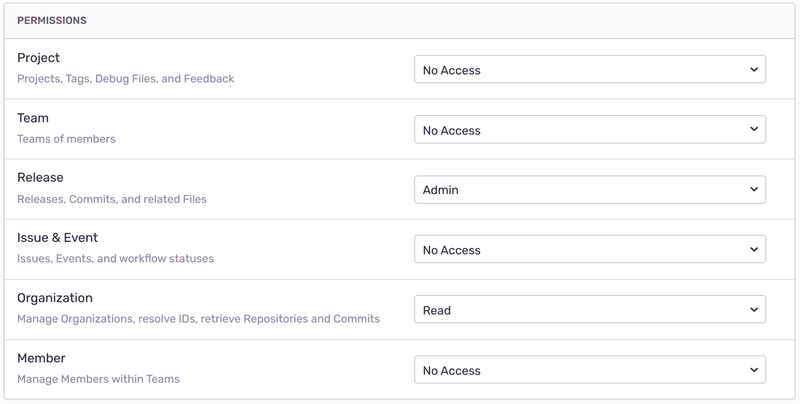

# Sentry Release GitHub Action
Automatically create a Sentry release in a workflow. 

A release is a version of your code that can be deployed to an environment. When you give Sentry information about your releases, you unlock a number of new features:
 - Determine the issues and regressions introduced in a new release
 - Predict which commit caused an issue and who is likely responsible
 - Resolve issues by including the issue number in your commit message
 - Receive email notifications when your code gets deployed

Additionally, releases are used for applying source maps to minified JavaScript to view original, untransformed source code. You can learn more about releases in the [releases documentation](https://docs.sentry.io/workflow/releases).

## Prerequisites
#### Create a Sentry Internal Integration
For this action to communicate securely with Sentry, you'll need to create a new internal integration. In Sentry, navigate to: _Settings > Developer Settings > New Internal Integration_.

Give your new integration a name (for example, "GitHub Action Release Integration”) and specify the necessary permissions. In this case, we need Admin access for “Release” and Read access for “Organization”.



Click “Save” at the bottom of the page and grab your token, which you’ll use as your `SENTRY_AUTH_TOKEN`. We recommend you store this as an [encrypted secret](https://docs.github.com/en/actions/configuring-and-managing-workflows/creating-and-storing-encrypted-secrets).

## Usage
Adding the following to your workflow will create a new Sentry release and tell Sentry that you are deploying to the `production` environment.
  
```yaml
- uses: actions/checkout@v2
- name: Create Sentry release
  uses: getsentry/action-release@v1
  env:
    SENTRY_AUTH_TOKEN: ${{ secrets.SENTRY_AUTH_TOKEN }}
    SENTRY_ORG: ${{ secrets.SENTRY_ORG }}
    SENTRY_PROJECT: ${{ secrets.SENTRY_PROJECT }}
  with:
    environment: production
```

### Inputs
#### Environment Variables
The following are all _required_.

|name|description|
|---|---|
|`SENTRY_AUTH_TOKEN`|Authentication token for Sentry. See [installation](#create-a-sentry-internal-integration).|
|`SENTRY_ORG`|The slug of the organization name in Sentry.|
|`SENTRY_PROJECT`|The slug of the project name in Sentry.|
#### Parameters
|name|description|default|
|---|---|---|
|`environment`|Set the environment for this release. E.g. "production" or "staging". Omit to skip adding deploy to release.|-|
|`finalize`|When false, omit marking the release as finalized and released.|`true`|
|`sourcemaps`|Space-separated list of paths to JavaScript sourcemaps. Omit to skip uploading sourcemaps.|-|
|`started_at`|Unix timestamp of the release start date. Omit for current time.|-|
|`version`|Identifier that uniquely identifies the releases. _Note: the `refs/tags/` prefix is automatically stripped when `version` is `github.ref`._|<code>${{&nbsp;github.sha&nbsp;}}</code>|
|`version_prefix`|Value prepended to auto-generated version. For example "v".|-|
|`set_commits`|Specify whether to set commits for the release. Either "auto" or "skip".|"auto"|
|`projects`|Space-separated list of paths of projects. When omitted, falls back to the environment variable `SENTRY_PROJECT` to determine the project.|-|
|`url_prefix`|Adds a prefix to source map urls after stripping them.|-|

### Examples
- Create a new Sentry release for the `production` environment and upload JavaScript source maps from the `./lib` directory.
    ```yaml
    - uses: getsentry/action-release@v1
      with:
        environment: 'production'
        sourcemaps: './lib'
    ```

- Create a new Sentry release for the `production` environment of your project at version `v1.0.1`.
    ```yaml
    - uses: getsentry/action-release@v1
      with:
        environment: 'production'
        version: 'v1.0.1'
    ```

## Troubleshooting
Suggestions and issues can be posted on the repository's 
[issues page](https://github.com/getsentry/action-release/issues).
- Forgetting to include the required environment variables 
  (`SENTRY_AUTH_TOKEN`, `SENTRY_ORG`, and `SENTRY_PROJECT`), yields an error that looks like: 
    ```
    Environment variable SENTRY_ORG is missing an organization slug
    ```
- Building and running this action locally on an unsupported environment yields an error that looks like:
    ```
    Syntax error: end of file unexpected (expecting ")")
    ```
- When adding the action, make sure to first checkout your repo with `actions/checkout@v2`.
Otherwise it could fail at the `propose-version` step with the message:
    ```
    error: Could not automatically determine release name
    ```

## Contributing
See the [Contributing Guide](https://github.com/getsentry/action-release/blob/master/CONTRIBUTING).

## License
See the [License File](https://github.com/getsentry/action-release/blob/master/LICENSE).
