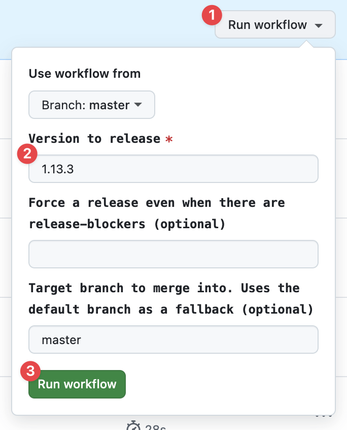

# Publishing a Release

_These steps are only relevant to Sentry employees when preparing and publishing a new release._

1. Open the [Prepare Release workflow](https://github.com/getsentry/sentry-javascript/actions/workflows/release.yml) and
   fill in 
   1. Click gray `Run workflow` button
   2. Fill in the version you want to release, e.g. `1.13.3`
   3. Click the green `Run workflow` button
2. A new issue should appear in https://github.com/getsentry/publish/issues.
3. Wait until the CI check runs have finished successfully (there is a link to them in the issue).
4. Once CI passes successfully, ask a member of the
   [@getsentry/releases-approvers](https://github.com/orgs/getsentry/teams/release-approvers) to approve the release.
